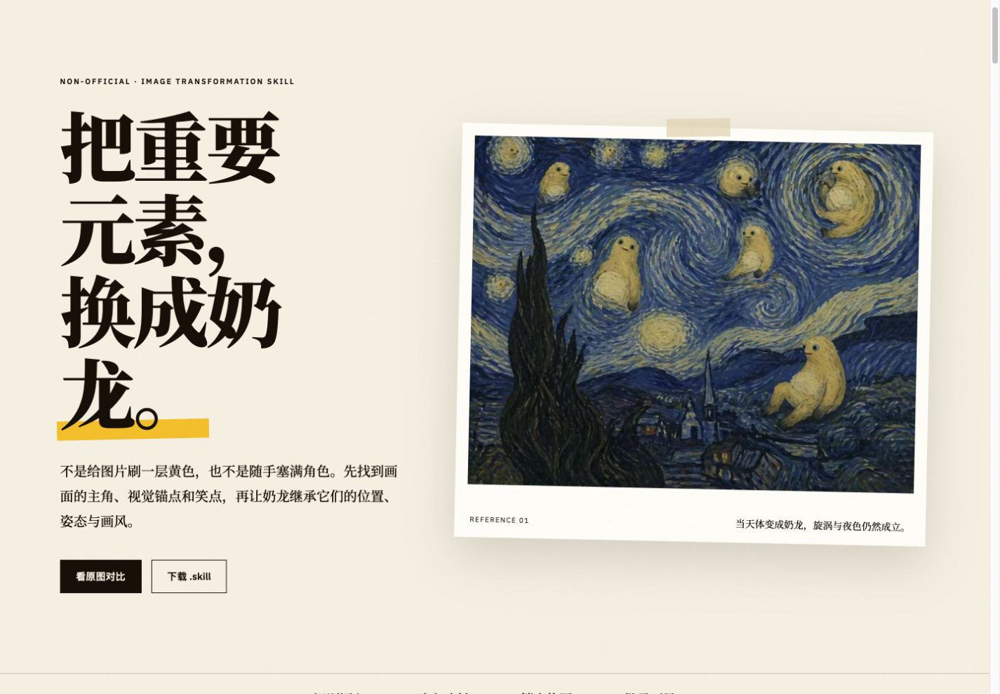
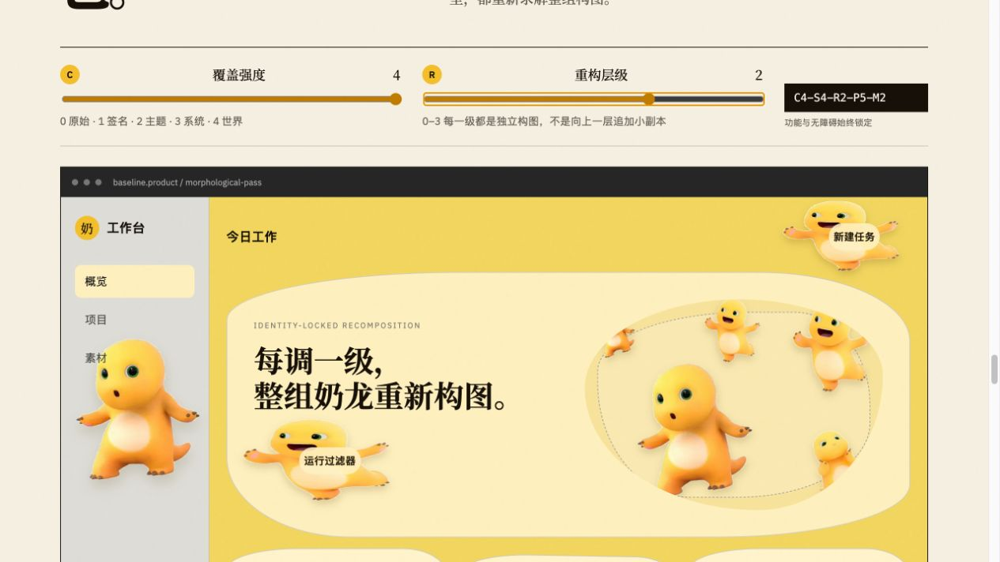

# 奶龙化设计系统

把表情包、名画、照片或插画中的关键视觉元素替换成奶龙，也可以作为其他设计 Skill 的最终过滤器，把完整前端的结构、组件、图像、纹理和动效系统性奶龙化。

[](https://forktomorrow.github.io/nailong-image-transform-skill/)

[在线体验](https://forktomorrow.github.io/nailong-image-transform-skill/) · [下载最新版 `.skill`](https://github.com/Forktomorrow/nailong-image-transform-skill/releases/latest/download/nailong-transform.skill) · [查看图片 Skill](skills/transform-images-with-nailong/SKILL.md) · [查看全局设计过滤器](skills/nailongize-designs/SKILL.md)

仓库包含三种用法：

- 图片：调用 `$transform-images-with-nailong`，上传图片并说明要替换的视觉锚点。
- 前端与完整设计：先使用任意基础设计 Skill，再调用 `$nailongize-designs` 作为最终过滤器。
- 其他生图模型：上传图片，复制 `skills/transform-images-with-nailong/references/universal-prompt.md` 中的通用编辑块。

## 目录

```text
.codex-plugin/plugin.json
skills/transform-images-with-nailong/
├── SKILL.md
├── agents/openai.yaml
├── references/
│   ├── character-spec.md
│   ├── character-topology-contract.md
│   ├── examples.md
│   ├── transformation-patterns.md
│   └── universal-prompt.md
└── assets/
    ├── examples/starry-night-nailong-example.jpg
    └── reference/
        ├── nailong-reference-board.webp
        └── pose-*.webp
skills/nailongize-designs/
├── SKILL.md
├── agents/openai.yaml
├── references/
│   ├── filter-contract.md
│   ├── fractal-composition.md
│   ├── frontend-layer-matrix.md
│   └── validation.md
└── assets/
    ├── nailong-filter.template.yaml
    └── nailong-tokens.css
```

## 使用示例

```text
使用 $transform-images-with-nailong，把这张表情包中决定笑点的人物和道具替换成奶龙，字幕、背景和构图保持不变。
```

模型如果不认识“奶龙”，请同时附上示例图，并保留 Skill 中的完整外观描述。

前端组合示例：

```text
先完成这个产品的基础前端设计，冻结功能、内容、无障碍和响应式行为。
然后使用 $nailongize-designs，以 C4-S4-R2-P5-M2 作为最终过滤器。
需要重绘页面图片时调用 $transform-images-with-nailong。
```

高强度过滤器使用 `C4-S4-R2-P5-M2`：覆盖与结构深入到完整设计系统，使用同画风的大、中、小奶龙共同拟合轮廓、凹角与窄缝，同时把功能、内容、无障碍和响应式行为锁定在最高保护级别。这里的 `R2` 是一次独立的多尺度构图求解，不是图片套图片，也不是在 R1 上继续追加小角色。角色参考板与拓扑合同会锁定头身连续、浅色大肚皮、短粗四肢、粗短尾和面部锚点，避免退化成黄色椭圆吉祥物。

[](https://forktomorrow.github.io/nailong-image-transform-skill/#filter-lab)

## 视觉测试

展示页包含星空原图滑动对比，《蒙娜丽莎》《创造亚当》《呐喊》等西方构图测试，富春山居、千里江山、水墨奔马和敦煌飞天等东方绘画实验，以及组件形态编译、小红书式瀑布流、B站式视频网格和淘宝式搜索/类目结构的非官方奶龙化推演。页面源码位于 `docs/`，由 GitHub Pages 发布。

## 安装

把本仓库作为 Codex 插件源安装，或复制 `skills/transform-images-with-nailong` 到本地 Skills 目录。安装后重新打开一个任务，让 Codex 重新发现 Skill。

## 说明

本项目是非官方的提示词与工作流工具，与奶龙角色权利方无隶属或授权关系。MIT 许可仅覆盖本仓库原创的文字、配置和代码，不覆盖奶龙角色形象、示例底图或其他第三方素材。使用生成结果时请遵守所用平台规则及当地版权、商标和肖像权要求。

`assets/reference/` 中的图片仅用于角色识别、拓扑校验与非官方研究展示，不代表官方授权；角色形象及参考素材权利归相应权利方。公开使用或再分发前请自行确认授权范围。
